Your final task of Week 1 is to prepare your Learning Analytics Toolkit by setting up and getting familiar with the required texts and software we'll be using throughout the course.

## Part 1: Text & Software

The first step in preparing your toolkit is making sure you can access the required course texts and data analysis software. These required texts and software, as well as optional but recommended software and texts, are describe in more detail in our [ECI 586 Course Syllabus](https://docs.google.com/document/d/1ermP8p8yFRaDgtKOrdoA4fV3LxW8GiMT0sMuaoUdarE/edit?usp=sharing).

### **Course Texts**

There are several required textbooks for this course, all of which are freely available online or through the NCSU Library. Supplemental course readings and content (e.g. articles, videos) will also be provided at no cost through the Moodle course site. You will also be asked to locate articles of interest for our discussions and I highly recommend that you link Google Scholar to the NCSU Library: <https://www.lib.ncsu.edu/articles/google-scholar>.

Course readings will draw heavily from the following resources:  

1.  Krumm, A., Means, B., & Bienkowski, M. (2018). [*Learning analytics goes to school: A collaborative approach to improving education.*](https://www-taylorfrancis-com.prox.lib.ncsu.edu/books/mono/10.4324/9781315650722/learning-analytics-goes-school-barbara-means-andrew-krumm-marie-bienkowski) Routledge.

2.  Estrellado, R. A., Freer, E. A., Mostipak, J., Rosenberg, J. M., & Velásquez, I. C. (2020). [*Data science in education using R*.](https://datascienceineducation.com/) Routledge.

3.  Lang, C., Siemens, G., Wise, A., & Gasevic, D. (Eds.). (2017). [*Handbook of learning analytics (1st Edition)*.](https://www.solaresearch.org/publications/hla-17/) New York, NY, USA: SoLAR, Society for Learning Analytics and Research.

4.  Lang, C., Siemens, G., Wise, A., & Gasevic, D., Merceron, A. (Eds.). (2022). [*Handbook of learning analytics (2nd. ed.)*.](https://www.solaresearch.org/publications/hla-22/ "https://www.solaresearch.org/publications/hla-22/") Vancouver, BC. SoLAR, Society for Learning Analytics and Research. DOI: 10.18608/hla22

5.  Carolan, B. V. (2013). [*Social network analysis and education: Theory, methods & applications*.](methods.sagepub.com/book/mono/social-network-analysis-and-education/toc#_) Sage Publications.

### Data Analysis Software

Hands-on data analysis tutorials and experiences will make extensive use of R and R Studio during the semester. You will access Learning Analytics Case Study activities through Posit Cloud and will complete R tutorials to assist with these activities through DataCamp.

1.  **DataCamp** ([https://www.datacamp.com](https://www.datacamp.com/)) (see Part 2 for step-by-step instructions). ***Purpose in This Course:** This is where you will complete **interactive R tutorials** during Week 2 of each unit to build your skills before using them in Posit Cloud.* DataCamp is an online learning platform with a large catalog of video tutorials, coding activities, assessments and certifications for R, Python, data science, statistics & more.

    -   Register for a free account using your \@ncsu.edu email address at: <https://www.datacamp.com/users/sign_up>
    -   After registering with your NC State email, click the following link to access our [ECI 586 Intro to Learning Analytics DataCamp group space](https://www.datacamp.com/groups/shared_links/50928b578afc5cacc07dec9062b31665a682f4acd70cda838182c1b56d86d854) where you will complete required assignments during Week 2 of each unit.

2.  **Posit Cloud** (<https://posit.co/products/cloud/cloud/)> (see Part 3 for step-by-step instructions). ***Purpose in This Course:** This is where you will complete **Case Study assignments** during the final week of each unit. You’ll use it to run code, analyze data, and produce your final reports.* Posit Cloud provides access to Posit's powerful set of data science tools, including **RStudio** ([https://posit.co/products/open-source/rstudio](https://posit.co/products/open-source/rstudio/)), an integrated development environment (IDE) for R and Python that includes a console and syntax-highlighting editor, as well as tools for plotting, history, debugging, and workspace management. As part of our Case Studies, we'll also be making extensive use of **Quarto** ([https://quarto.org](https://quarto.org/)), an open-source scientific and technical publishing system used for creating reproducible, production quality articles, presentations, dashboards, websites, blogs, and books in HTML, PDF, MS Word, ePub, and more.

    -   First, register for a free Posit Cloud account at: <https://login.posit.cloud/register>
    -   Next, access our ECI 586 Intro to Learning Analytics workspace at: <https://posit.cloud/spaces/806446/join?access_code=5kQ2_uFmOaGLmwDPAUExEX34cyr-9xP84wR7uqK_>

## Part 2: Introduction to R DataCamp Assignment

The second step in preparing your Learning Analytics Toolkit is to join our Learning Analytics group on DataCamp and complete your first assignment: Introduction to R.

### Sign Up

First, sign up for a DataCamp account using your NC State email.

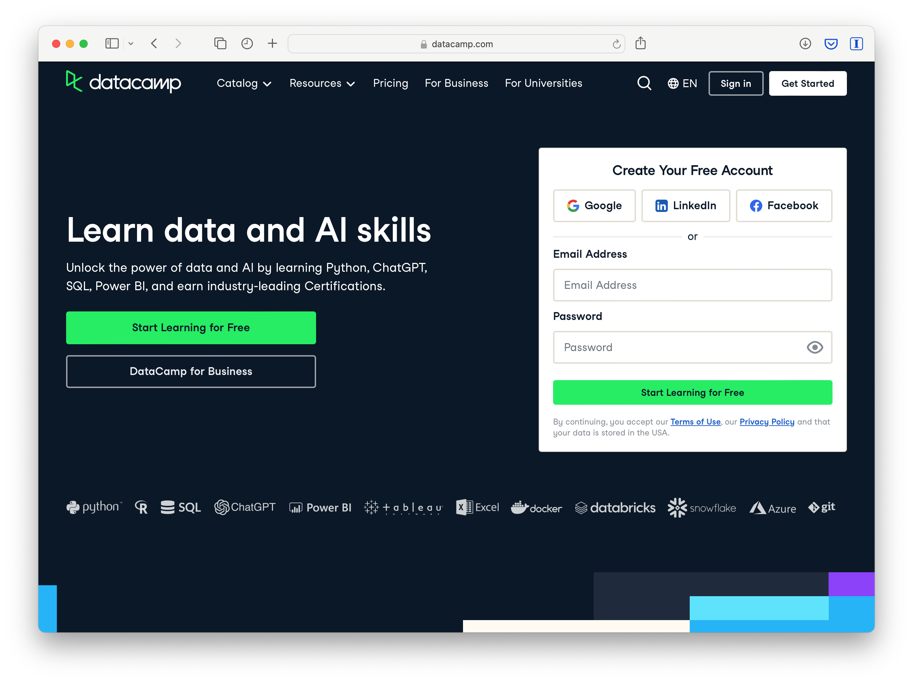{width="927"}

### Join Group

Next, click the following link to access our [Learning Analytics DataCamp group space](https://www.datacamp.com/groups/shared_links/b6b84feb66a4f045585bb4dbe7eb154418aef1136ccef4450d5eb3f453b0e136). You will be informed that you have been invited to join the space and should see something like below. Click "Join" to accept the invite to our group and then the "Getting Started" button on the page that follows.

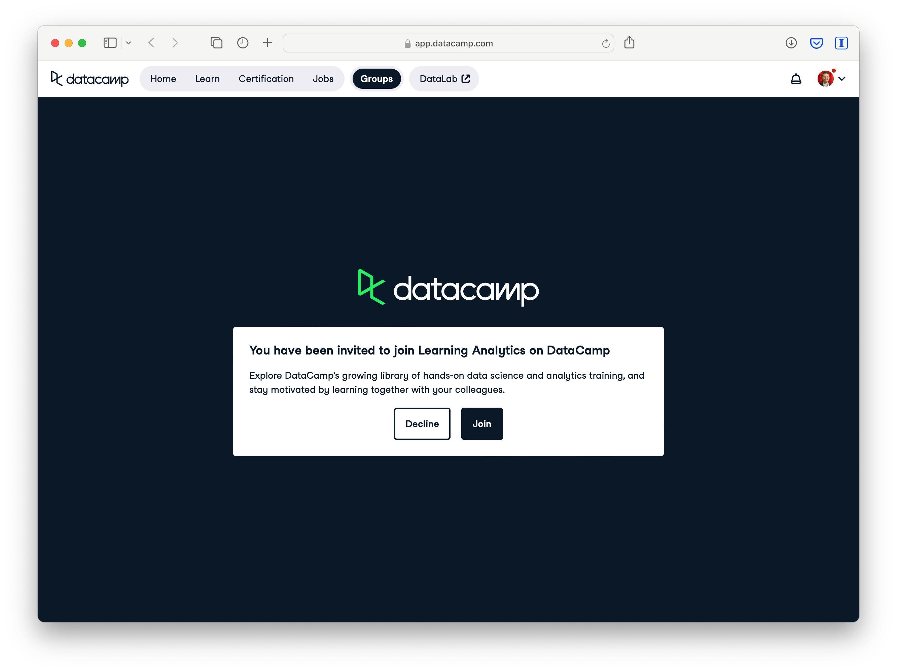{width="944"}

Next you'll be prompted to "Start with the course that Joey Huang has assigned to you" or "Go to the Dashboard -\>" instead. You're welcome to get started immediately on the **Introduction to R** course, but I recommend taking a quick visit to the group dashboard first. {width="953"}

### Visit Dashboard

The DataCamp Dashboard is where you can access DataCamp courses, tutorials, assessments, certifications, etc. As part of the educator group I set up for this course and for the [LASER Institute](https://fi.ncsu.edu/projects/laser-institute/), you have free access to the full suite of DataCamp instructional resources for the fall semester!

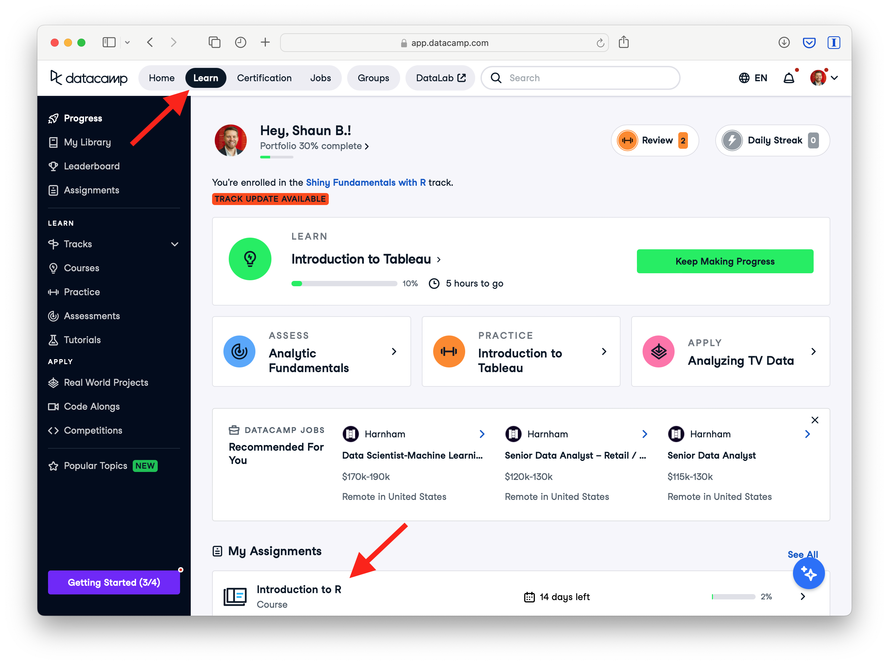{width="953"}

Feel free to explore the dashboard board and click around to check out the resources available to you. To get back to this page, click the "Learn" button in the menu bar at the top of the page.

### Start Assignment

You should see the **Introduction to R** course assignment on your dashboard. Click on that to get started on the assignment. Once, you do you should the see the course landing page picture below.

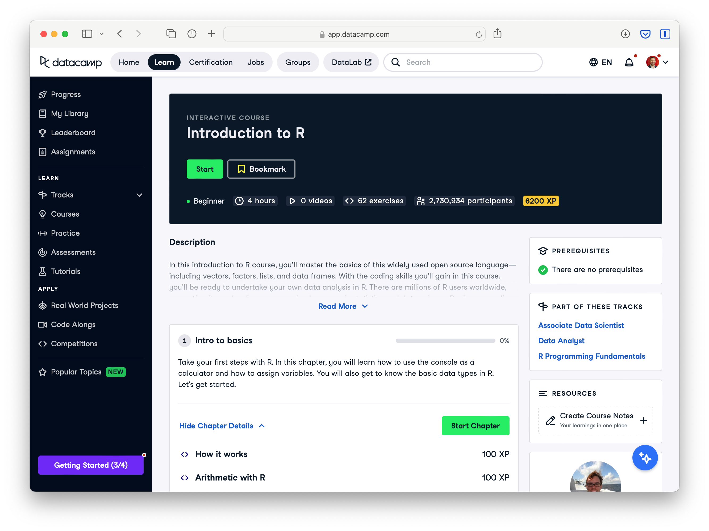{width="913"}

Click "Start' to get started on the assignment. Once you do, you'll see an exercise with a set of instructions on the left, and on the right you'll see a code editor and R Console for writing and running code and viewing the outputs of the R code you run.

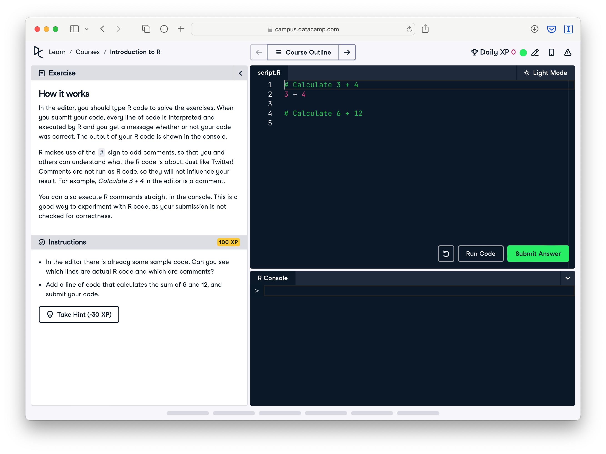{width="948"}

Good luck and don't hesitate to reach out if you have any questions or run into any issues!

## Part 3: Getting Started with Posit Cloud

Your final step in preparing your toolkit is to complete our introductory Case Study designed to help get you up and running with RStudio and working with Quarto. This brief activity is designed to orient you to the data analysis assignments during the final week of each unit, including the use of R, RStudio, and Quarto.

### Sign Up

If you haven't done so already, be sure to sign up for a free Posit account. You can access the free plan directly using this link: <https://posit.cloud/plans/free>.

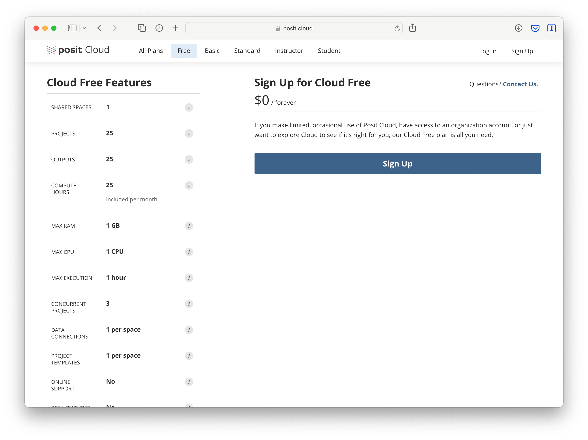{width="948"}

### Join Space

Next, access our [ECI 586 Intro to Learning Analytics_Fall 2025](https://posit.cloud/spaces/677551/join?access_code=19XaljG95C_VBh5GKD2c_7CCp5jrxhc1_NcdjN1S) workspace. This space is part of my paid plan and will provide you unlimited use of Posit Cloud during the semester. You should see a prompt to "Join Space?" like the one below:

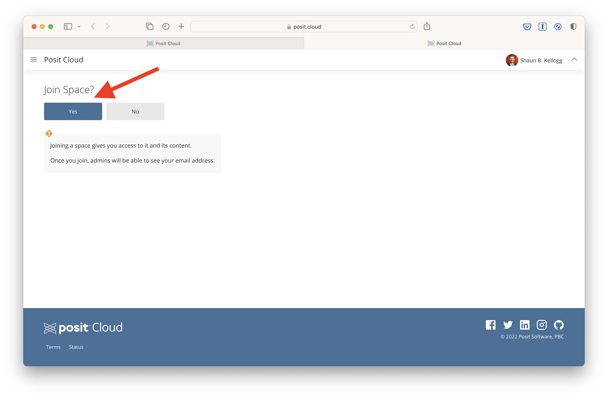{width="96%"}

### View Content & Start Assignment

Once you have accessed the content section of our workspace, click on the assignment labeled **Unit 0 - Getting Started**, which will create a copy of the R Project for your individual use.

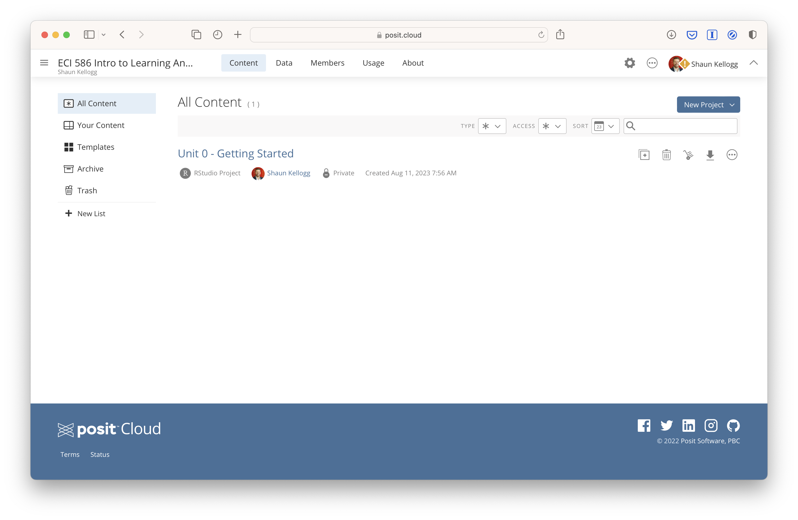{alt="" fig-align="center" width="926"}

### Open Case Study

Next, click on the `unit-0-case-study.qmd` file located in the Files tab of your R Studio cloud project. This will open the **Unit 0: Getting Started Case Study** assignment. This assignment is created using a Quarto document, which allows

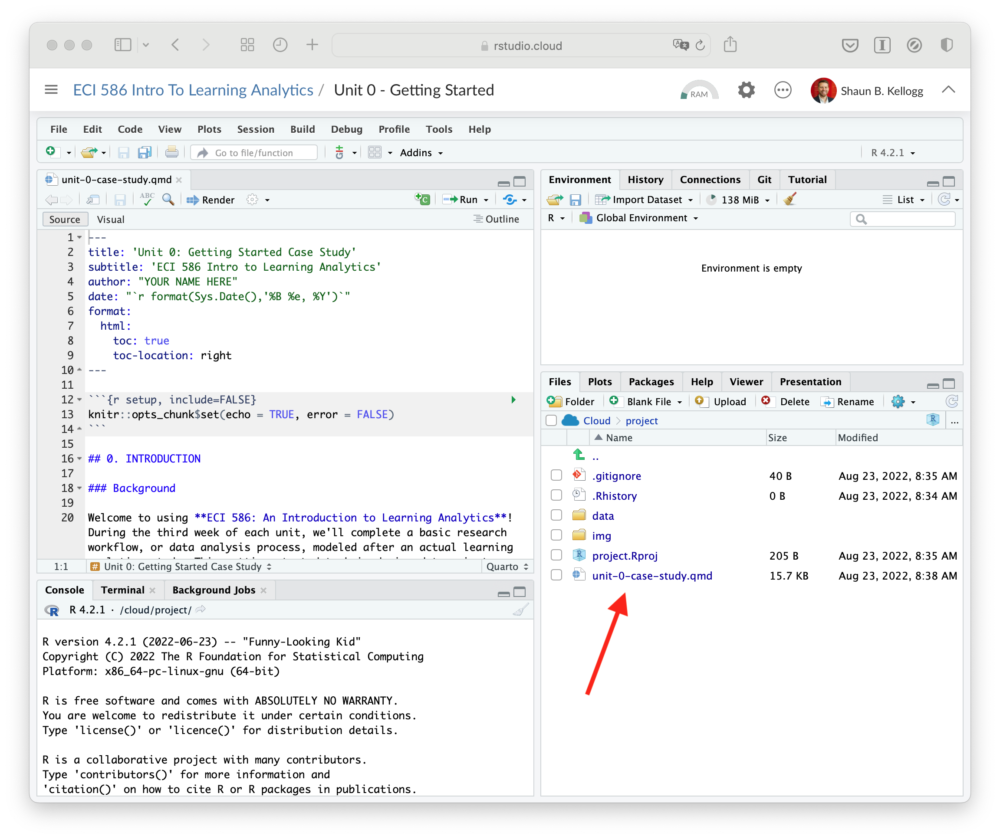{fig-align="center" width="926"}

Finally, if the document opens in "Source" mode and looks like unformatted text, click on the "Visual" button in the toolbar of the file you just opened and follow the direction to complete the assignment.

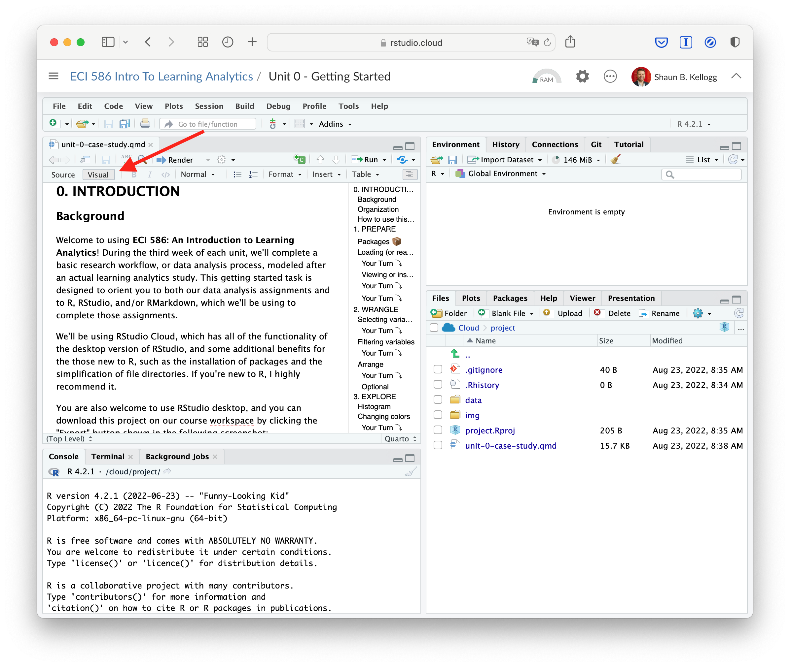{fig-align="center" width="927"}

### Your Turn

Complete the assignment by reading through the document and completing coding activities and reflection questions where you see the [**Your Turn**]{style="color: green;"} **⤵** signal. Be sure to complete all your the activities or your document will not "render" to an HTML webpage when you have completed the assignment.

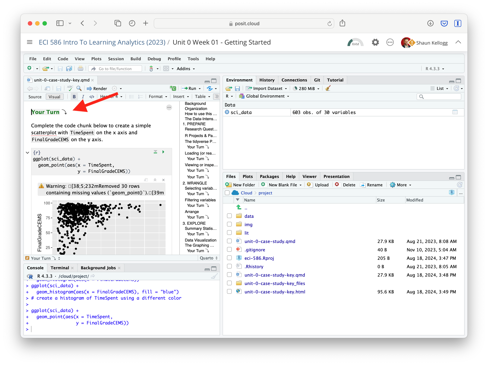{width="969"} Good luck and don't hesitate to reach out if you have any questions or run into any issues!

## Troubleshooting

Learning a programming language like R (or any new language for that matter) will inevitably be a little frustrating at first. One of the most important developers of R packages (and co-author of our textbook), Hadley Wickham, was recently [quoted in an interview](https://r-posts.com/advice-to-young-and-old-programmers-a-conversation-with-hadley-wickham/):

> "It's easy when you start out programming to get really frustrated and think, 'Oh it's me, I'm really stupid,' or, 'I'm not made out to program.' But, that is absolutely not the case. Everyone gets frustrated. I still get frustrated occasionally when writing R code. It's just a natural part of programming. So, it happens to everyone and gets less and less over time. Don't blame yourself. Just take a break, do something fun, and then come back and try again later."

When feeling stuck or like banging your head against your desk, there are several options for seeking out help within and beyond this course:

1.  **Course Forums & Email**: Including this general software troubleshooting forum, we will have forums for each assignment. You'll likely have similar questions as your peers, and you'll likely be able to answer other peoples' questions too so I encourage you to use these forums. Unlike most of my apps and social media accounts, I actually have notifications enabled. Also, do not hesitate to email me directly as well.

2.  **Learning Analytics Office Hours**: Some issues are much easier to troubleshoot in real time. To schedule a 1 on 1 meeting with me in person of via Zoom, use the following Calendly link: <https://calendar.app.google/wJQdAoTmxniCfueB8>

3.  **Google NotebookLM** (<https://notebooklm.google>): A powerful AI-assisted study tool designed to help you deeply engage with course readings. You can upload assigned texts, articles, or your own notes, and receive concise summaries, detailed explanations, and thought-provoking discussion prompts. Use it to break down complex concepts, track key themes, and draw connections across multiple readings, which will help you prepare for discussions and reinforce your understanding of the material.

4.  **ChatGPT** (<https://openai.com/chatgpt/>): An advanced AI language model developed by OpenAI that can help explain concepts, assist with code, offer analysis guidance, and help troubleshoot. Always verify advice against reliable sources. Use with or without registering for an account at: <https://chatgpt.com>

5.  **NCSU Library Services**: The [Data & Visualization](https://www.lib.ncsu.edu/services/data-visualization) group is an incredible asset for NC State students. Though the library's website, you can access and enroll in workshops, find resources, and chat or schedule a Zoom appointment to get R help.

6.  **Social Media**: If you use X (Twitter), you can also post R-related questions and content with the [#rstats](https://twitter.com/search?q=%23rstats&src=typed_query) hashtag. One of the things I most value about the R in general is that the R community is exceptionally helpful.

7.  **The Interwebs**: Aside from Google of course, [StackOverflow](https://stackoverflow.com/) and the [RStudio Community](https://community.rstudio.com/) will likely become tried and true tools in your text mining toolkit. In fact, I'd wager that the majority of Google searcher will likely direct you to one of these two sites. Note that when search Google, it sometimes helps to include "rstats" in your query.

**Acknowledgment** Portions of the course materials, including the Learning Analytics Toolkit and related instructions, are adapted with permission from materials originally developed by Dr. Shaun Kellogg.