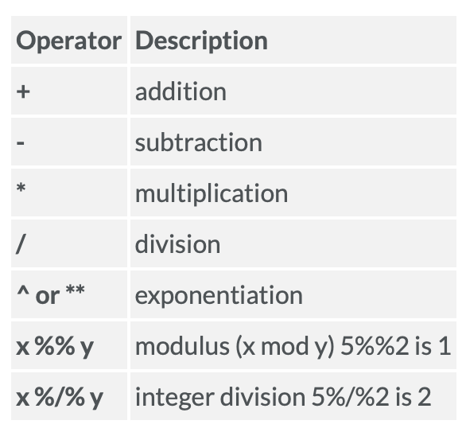
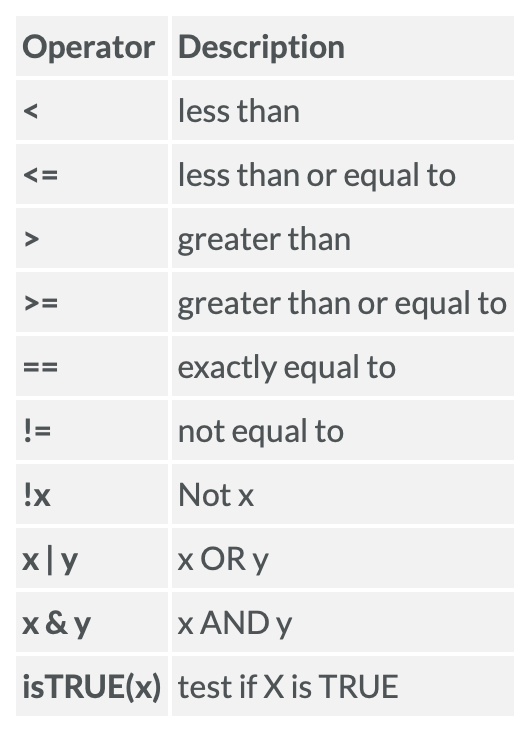
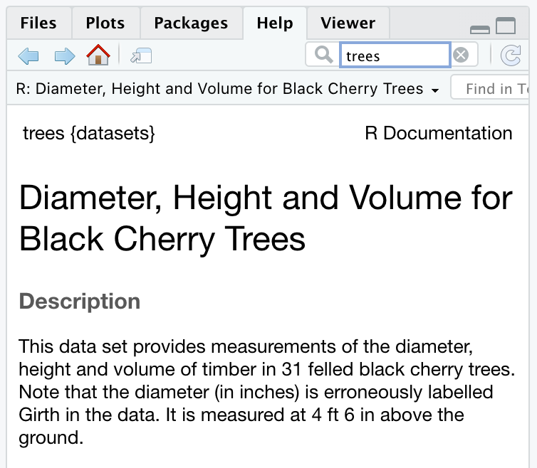
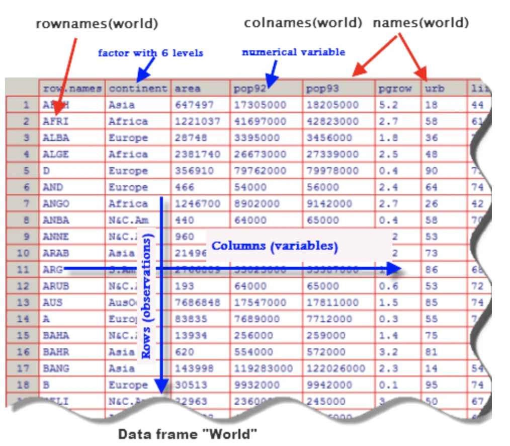
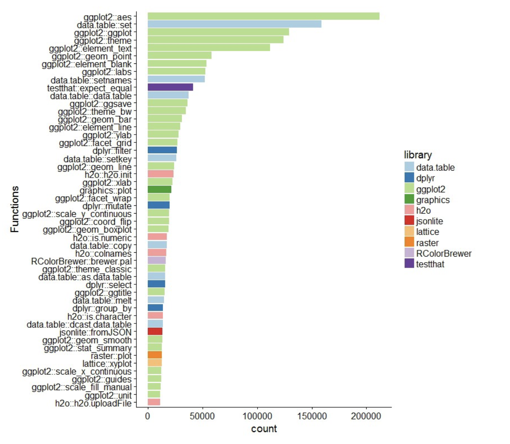
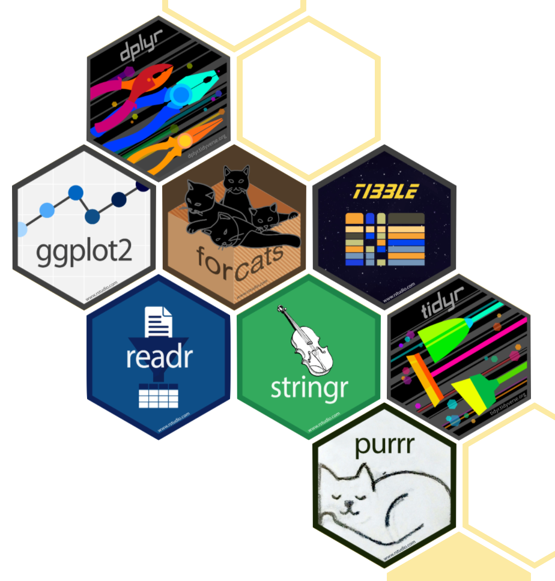
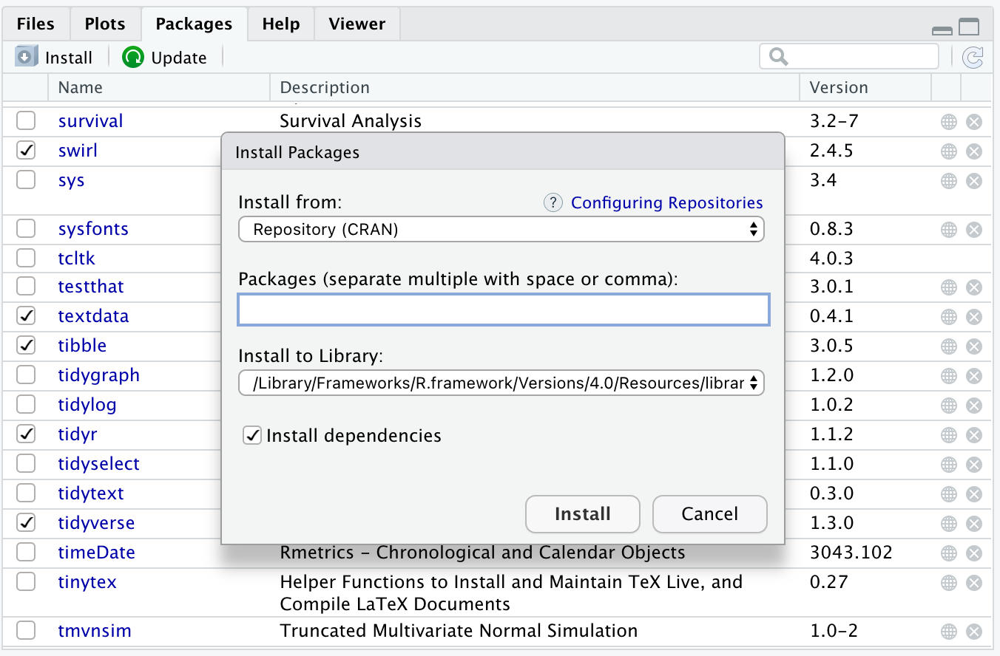

The R Toolkit
========================================================
date: September 11, 2023
author: ECI 586: Intro to Learning Analytics
autosize: false
transition: linear
font-family: 'Helvetica'

*Adapted from:*  
Data Science in Education Using R - Chapter 6  
<https://datascienceineducation.com>  
Data Science in a Box - Hello World!  
<https://datasciencebox.com>  


Today's Agenda
========================================================

**R Tools**  

1. Numbers & Operators
2. Objects & Data
3. Functions & Arguments
4. Packages
5. RStudio Projects 

---

**Bring it Together**

6. Project Setup
7. Exploring Data
8. Pipe Operator
9. Assignment vs. Equality
10. Object Naming


<!--
Notes... 
-->


NUMBERS & OPERATORS
========================================================
type: section

Arithmetic, Logic, & Assignment


R is a Calculator
========================================================
Numbers and basic arithmetic operators (+ , - , *, /) behave as expected.  
  
Type this in your console:  

```r
2 + 3
```
  
You'll get this:

```
[1] 5
```

---

Arithmetic Operators 



R is Logical
========================================================

R can also perform logical operations.  
  
What happens when you type this in your console?  

```r
5 > 3
```
  
Or this?

```r
5 == 3
```

What symbol seems to be missing? Or rather has been replaced? 

---

Logical Operators 



The Assignment Operator(s)
========================================================

**Bad Form**


```r
my_variable = 2 + 3

my_variable
```

```
[1] 5
```

---

**Good Form**


```r
my_dog <- "Howie"

my_dog
```

```
[1] "Howie"
```

<!--
Prompt to type into console
-->

Other Essential Operator(s)
========================================================

**The Dollar $ign**
<small>Used to select variables.</small>  


```r
trees$Height
```


```
[1] 70 65 63 72 81 83
```
  

<small>Now you try:  
Select `Girth`,  
assign to variable `tree_girth`,  
print to console.</small>  

---

**The Question Mark?**  
<small>Used to get help.</small>  


```r
?trees
```




OBJECTS & DATA
========================================================
type: section

Everything is an object in R! 

We'll be creating a lot of them... 

Especially objects of the **`class`** data frame

Data Types
=========================================================

**Numeric**


```r
my_sum <- 3+3

class(my_sum)
```

```
[1] "numeric"
```

```r
print(my_sum)
```

```
[1] 6
```

------

**Character**


```r
my_cat <- "Muffins"

class(my_cat)
```

```
[1] "character"
```

```r
my_cat
```

```
[1] "Muffins"
```

Data Types Cont. 
=========================================================

**Vector**


```r
my_vector <- c(1,2,3,4)

class(my_vector)
```

```
[1] "numeric"
```

```r
print(my_vector)
```

```
[1] 1 2 3 4
```

------

**List**


```r
my_list <- c(1,"Muffins", 3)

class(my_list)
```

```
[1] "character"
```

```r
my_list
```

```
[1] "1"       "Muffins" "3"      
```

Data Types Cont. 
=========================================================

**Matrix**


```r
my_matrix <- matrix(1:9, nrow = 3, ncol = 3)

print(my_matrix)
```

```
     [,1] [,2] [,3]
[1,]    1    4    7
[2,]    2    5    8
[3,]    3    6    9
```

------

**Data Frame**


```r
my_df <- trees

head(my_df)
```

```
  Girth Height Volume
1   8.3     70   10.3
2   8.6     65   10.3
3   8.8     63   10.2
4  10.5     72   16.4
5  10.7     81   18.8
6  10.8     83   19.7
```

<!--Text comment-->

Data Frame Example
=========================================================
title: false

 


Objects Concluded
=========================================================

Aside from being a certain ***class***, objects can have have other attributes, such column names and dimensions:

```r
colnames(my_df)
```

```
[1] "Girth"  "Height" "Volume"
```

```r
dim(my_df)
```

```
[1] 31  3
```

And can even be used with operators! Try this:


```r
my_sum * my_matrix
```


FUNCTIONS
========================================================
type: section

Functions are pre-packaged pieces of code that (typically) start with a verb, followed by objects or inputs in parentheses called "arguments":


```r
do_this(to_this)  
do_that(to_this, to_that, with_those)
```


Let's make a function!
========================================================

Basic template for creating a function:  


```r
name_of_function <- function(argument_1, argument_2){
    code_that_does_something
    code_that_does_something_else
}
```

Try making this basic addition function: 


```r
add_numbers <- function(number_1, number_2) {
    number_1 + number_2
}
```

Let's test it!
========================================================

Use your new function to add 1 and 2:


```r
add_numbers(1, 2)
```

```
[1] 3
```


What happens if we try add the objects we created earlier?

```r
add_numbers(my_sum, my_matrix)
```

What about these objects?

```r
add_numbers(my_sum, my_list)
```


Most popular (non-base R) functions on GitHub
========================================================
title: 



PACKAGES
========================================================
type: section 

  
Collections of R code that contain functions, data, and/or documentation.  

The **tidyverse** is an *opinionated* collection of R packages designed for data science we'll use a lot. 

---




Let's get some packages!
========================================================

**Installing a Package**

```r
# template for installing a package
install.packages("package_name")

# example of installing a package
install.packages("tidytext")
```

**Loading a Package**

```r
# template for loading a package
library(package_name)

# example of loading a package
libary(tidytext)
```

<!--Quotation marks-->

Or just point and click... 
========================================================




Let's get these installed too... 
========================================================


RSTUDIO PROJECTS
========================================================
type: section 

  Your home for code, files, reports and more. 

<!--
A Project is the home for all of the files, images, reports, and code that are used for data analysis project. 
-->

Why RStudio Projects? 
========================================================

- Projects create a **shareable self-contained folder** for your: 
    + files, images, reports, code, and subfolders
- Eliminates the need for computer specific files paths like this:  
    >`/Volumes/GoogleDrive/My Drive/College of Ed/Learning Analytics/Courses/ECI 588 Text Mining/R/eci-588/unit-1/img/project.png`
    
- And replaces with this, which anyone can run: 
>`unit-1/img/project.png`

DSIEUR Walkthrough
========================================================
type: section


---
Link:
<https://datascienceineducation.com>

Creating a Project and R Script
========================================================

**Live Demo**

<!--
Demo creating project.
Demo creating and saving R files
-->

Installing Packages
========================================================

Copy and paste from DSIEUR:

```r
# install devtools
install.packages("devtools", repos = "http://cran.us.r-project.org")

# install the dataedu package (requires R version 3.6 or higher)
devtools::install_github("data-edu/dataedu")

# Installing the skimr package, not included in {dataedu}
install.packages("skimr")
```

Loading Packages
========================================================

Let's set up our environment:

```r
library(tidyverse)

library(dataedu)

library(skimr)

library(janitor)
```


What do you think running the above lines of code accomplished?  
  
How do you know?

What do those conflicts mean? 


Using the "masked" functions... 
========================================================

Just specify the package followed by ::

```r
# using the filter() function from the stats package
x <- 1:100

stats::filter(x, rep(1, 3))

# using the filter() function from the dplyr package
starwars %>% 
    dplyr::filter(mass > 85)
```

Loading dataedu Data
========================================================


```r
dataedu::ma_data_init

dataedu::ma_data_init -> ma_data

ma_data_init <- dataedu::ma_data_init
```


Exploring Data and Common Errors
========================================================


```r
names(ma_data_init)

glimpse(ma_dat_init) 

glimpse(ma_data_init)

summary(ma_data_init)

glimpse(ma_data_init$Town)

summary(ma_data_init$Town)

glimpse(ma_data_init$AP_Test Takers)

glimpse(ma_data_init$`AP_Test Takers`)

summary(ma_data_init$`AP_Test Takers`)
```

<!--Take a few minutes to type out and run each of the following lines of code, one by one, and notice what you see happening in the Console after you run each line. 

If you’d like, practice commenting your code by noting what you see happening with each line of code that you run.

What differences do you see between each line of code? What changes in the output to the Console with each line of code that you run?-->

The Pipe Operator
========================================================


```r
ma_data_init %>% 
    group_by(District Name) %>%  
    count()

ma_data_init %>% 
    group_by(`District Name`) %>% 
    count()  
    
ma_data_init %>% 
    group_by(`District Name`) %>% 
    count() %>% 
    filter(n > 10)
```

<!--Take a few minutes to type out and run each of the following lines of code, one by one, and notice what you see happening in the Console after you run each line. 

You will run into an error message in one of the code chunks, but just try to understand what it means and continue.

What differences do you see between each line of code? What changes in the output to the Console with each line of code that you run?-->

"Reading" Code
========================================================


```r
ma_data_init %>% 
    group_by(`District Name`) %>% 
    count() %>% 
    filter(n > 10) %>% 
    arrange(desc(n))
```

Take the `ma_data_init` dataset  *and then*   
**group** it **by** `District Name` *and then*   
**count** (the number of schools in a district) *and then*   
**filter** for Districts with more than 10 schools *and then*   
**arrange** the list of Districts and the number of schools in each District in descending order, based on the number of schools.

Exploring Assignment vs. Equality
========================================================


```r
ma_data_init %>%
    group_by(`District Name`) %>%
    count() %>%
    filter(n = 10) 

ma_data_init %>%
    group_by(`District Name`) %>%
    count() %>%
    filter(n == 10) 

ma_data_init %>% 
    rename(district_name = `District Name`,
           grade = Grade) %>% 
    select(district_name, grade)
```

Why the error for the second and not the others?


Object and Variable Names Basics
========================================================


```r
ma data <- 
    ma_data_init %>% 
    clean_names()

01_ma_data <- 
    ma_data_init %>%  
    clean_names()

$_ma_data <- 
    ma_data_init %>%  
    clean_names()

ma_data_01 <- 
    ma_data_init %>% 
    clean_names()

MA_data_02 <- 
    ma_data_init %>% 
    clean_names()
```

LEARN MORE
========================================================
type: section

Required:  
[Chapters 5 & 6 of DSIEUR](https://datascienceineducation.com)

[RStudio Primers: Basics & Work With Data](https://rstudio.cloud/learn/primers)


Recommended:  
[LinkedIn Learning](https://www.linkedin.com/learning/)

[Data Quest](https://www.dataquest.io/course/intro-to-r-rewrite/)


<!--
Tidyverse
Tidytext
Demo Swirl
-->
