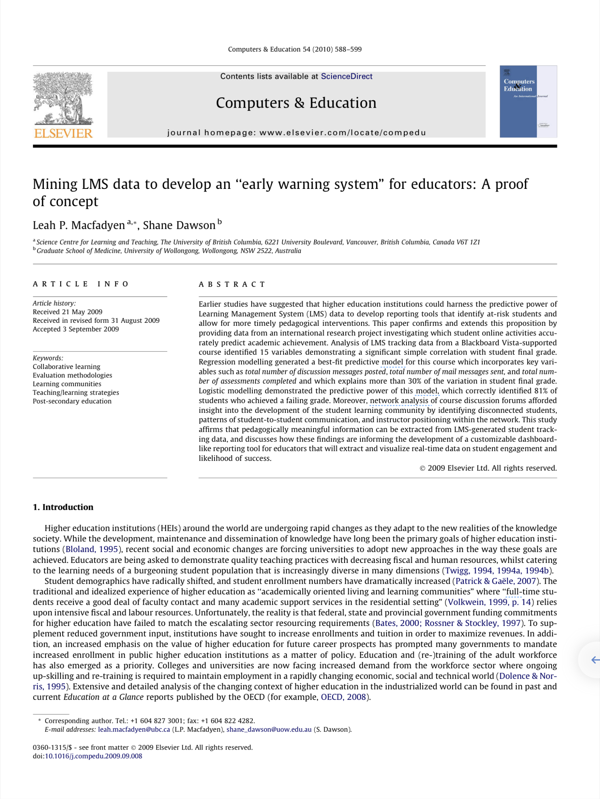

```{r setup, include=FALSE}
knitr::opts_chunk$set(echo = TRUE)
```

## 1. PREPARE

During the final week of each unit, will complete a "case study" to illustrate how Learning Analytics methods and techniques can be applied to address research questions of interest, create useful data products, and conduct reproducible research. Each case study is structured around a basic research workflow modeled after the Data-Intensive Research Workflow from [Learning Analytics Goes to School](https://catalog.lib.ncsu.edu/catalog/NCSU4862134) (Krumm et al., 2018). The primary purpose of these case studies is from *Learning Analytics Goes to School* (Krumm et al., 2018):

{width="70%"}

For Unit 1, we will focus on analysis of open-ended survey items from an evaluation of the North Carolina Department of Public Instruction (NCDPI) online professional development offered as part of the state's [Race to the Top](https://www2.ed.gov/programs/racetothetop/index.html) efforts. For more information about the Race to the Top evaluation work, visit [\<https://cerenc.org/rttt-evaluation/\>](https://cerenc.org/rttt-evaluation/){.uri}.\
our focus will be on getting our text "tidy" so we can perform some basic word counts, look at words that occur at a higher rate in a group of documents, and examine words that are unique to those document groups. Specifically, the Unit 1 Walkthrough will cover the following workflow topics:

1.  **Prepare**: Prior to analysis, it's critical to understand the context and data sources you're working with so you can formulate useful and answerable questions. You'll also need to set up a "Project" for our Unit 1 walkthrough.
2.  **Wrangle**: Wrangling data entails the work of manipulating, cleaning, transforming, and merging data. In section 2 we focus on reading, reducing, and tidying our data.
3.  **Explore**: In section 3, we use simple summary statistics, more sophisticated approaches like term frequency-inverse document frequency (tf-idf), and basic data visualization to explore our data and see what insight it provides in response to our question.
4.  **Model** our data until Unit 3 when we learn about topic models, we will be developing "data products" next week to
5.  **Communicate** our findings and insights.

### 1a. Review the Literature

Text Mining Module 1 is guided by a recent publication by *Understanding Public Sentiment About Educational Reforms: The Next Generation Science Standards on Twitter* [@rosenberg2021]. This study in turn builds on upon previous work by @wang2017 examining public opinion on the Common Core State Standards (CCSS) on Twitter. For Module 1, we will focus on analyzing tweets about the [Next Generation Science Standards](https://www.nextgenscience.org) (NGSS) and [Common Core State Standards](http://www.corestandards.org) (CCSS) in order to better understand key words and phrases that emerge, as well as public sentiment towards these two curriculum reform efforts.

#### Twitter and the Next Generation Science Standards

[{width="40%"}](https://doi.org/10.1177/23328584211024261)

[Full Paper (AERA Open)](https://journals.sagepub.com/doi/full/10.1177/23328584211024261)

##### Abstract

Earlier studies have suggested that higher education institutions could harness the predictive power of Learning Management System (LMS) data to develop reporting tools that identify at-risk students and allow for more timely pedagogical interventions. This paper confirms and extends this proposition by providing data from an international research project investigating **which student online activities accurately predict academic achievement.** Analysis of LMS tracking data from a Blackboard Vista-supported course identified 15 variables demonstrating a significant simple correlation with student final grade. Regression modelling generated a best-fit predictive model for this course which incorporates key variables such as total number of discussion messages posted, total number of mail messages sent, and total number of assessments completed and which explains more than 30% of the variation in student final grade. Moreover, **network analysis of course discussion forums** afforded insight into the development of the student learning community by identifying disconnected students, patterns of student-to-student communication, and instructor positioning within the network. This study affirms that pedagogically meaningful information can be extracted from LMS-generated student tracking data, and discusses how these findings are informing the **development of a dashboardlike reporting tool for educators** that will extract and visualize real-time data on student engagement and likelihood of success.

##### Data Sources

Similar to what we'll be learning in this lab, Rosenberg et al. used publicly accessible data from Twitter collected using the Full-Archive Twitter API and the `rtweet` package in R. Specifically, the authors accessed tweets and user information from the hashtag-based \#NGSSchat online community, all tweets that included any of the following phrases, with "/" indicating an additional phrase featuring the respective plural form: "ngss", "next generation science standard/s", "next gen science standard/s".

##### Analysis

Also similar to what we'll demonstrate in Lab 3, the authors determined Tweet sentiment using the Java version of SentiStrength to assign tweets to two 5-point scales of sentiment, one for positivity and one for negativity, because SentiStrength is a validated measure for sentiment in short informal texts (Thelwall et al., 2011). In addition, they used this tool because Wang and Fikis (2019) used it to explore the sentiment of CCSS-related posts. We'll be using the AFINN sentiment lexicon which also assigns words in a tweet to two 5-point scales, in addition to exploring some other sentiment lexicons to see if they produce similar results.

The authors also used the `lme4` package in R to run a mixed effects (or multi-level) model to determine if sentiment changes over time and differs between teachers and non-teacher. We won't look at the relationships between tweet sentiment, time and teachers in these labs, but we will take a look at the correlation between words within tweets in TM Learning Lab 2.

**Summary of Key Findings**

1.  Contrasting with sentiment about CSSS, sentiment about the NGSS science education reform effort is overwhelmingly positive, with approximately 9 positive tweets for every negative tweet.
2.  Teachers were more positive than non-teachers, and sentiment became substantially more positive over the ten years of NGSS-related posts.
3.  Differences between the context of the tweets were small, but those that did not include the \#NGSSchat hashtag became more positive over time than those posts that did not include the hashtag.
4.  Individuals posted more tweets during \#NGSSchat chats, the sentiment of their posts was more positive, suggesting that while the context of individual tweets has a small effect (with posts not including the hashtag becoming more positive over time), the effect upon individuals of being involved in the \#NGSSchat was positive.

Finally, you can watch Dr. Rosenberg provide a quick 3-minute overview of this work at [\<https://stanford.app.box.com/s/i5ixkj2b8dyy8q5j9o5ww4nafznb497x\>](https://stanford.app.box.com/s/i5ixkj2b8dyy8q5j9o5ww4nafznb497x){.uri}

### 1b. Define Questions

One overarching question that Silge and Robinson (2018) identify as a central question to text mining and natural language processing, and that we'll explore throughout the text mining labs this year, is the question:

> How do we to **quantify** what a document or collection of documents is about? The questions guiding the Rosenberg et al. study attempt to quantify public sentiment around the NGSS and how that sentiment changes over time. Specifically, they asked:

1.  What is the public sentiment expressed toward the NGSS?
2.  How does sentiment for teachers differ from non-teachers?
3.  How do tweets posted to \#NGSSchat differ from those without the hashtag?
4.  How does participation in \#NGSSchat relate to the public sentiment individuals express?
5.  How does public sentiment vary over time?

For our first lab on text mining in STEM education, we'll use approaches similar to those used by the authors cited above to better understand public discourse surrounding these standards, particularly as they relate to STEM education. We will also try to guage public sentiment around the NGSS, by comparing how much more positive or negative NGSS tweets are relative to CSSS tweets. Specifically, in the next four learning lab we'll attempt to answer the following questions:

1.  What are the most frequent words or phrases used in reference to tweets about the CCSS and NGSS?
2.  What words and hashtags commonly occur together?
3.  How does sentiment for NGSS compare to sentiment for CCSS?

### 1c. Load Libraries

#### tidyverse 📦

{width="20%"}

As noted in our Getting Started activity, R uses "packages" and add-ons that enhance its functionality. One package that we'll be using extensively is {tidyverse}. The {tidyverse} package is actually a [collection of R packages](https://www.tidyverse.org/packages) designed for reading, wrangling, and exploring data and which all share an underlying design philosophy, grammar, and data structures. This shared features are sometimes "tidy data principles."

Click the green arrow in the right corner of the "code chunk" that follows to load the {tidyverse} library as well as the {here} package introduced in previous labs.

```{r}
library(tidyverse)
library(here)
```

Again, don't worry if you saw a number of messages: those probably mean that the tidyverse loaded just fine. Any conflicts you may have seen mean that functions in these packages you loaded have the same name as functions in other packages and R will default to function from the last loaded package unless you specify otherwise.
