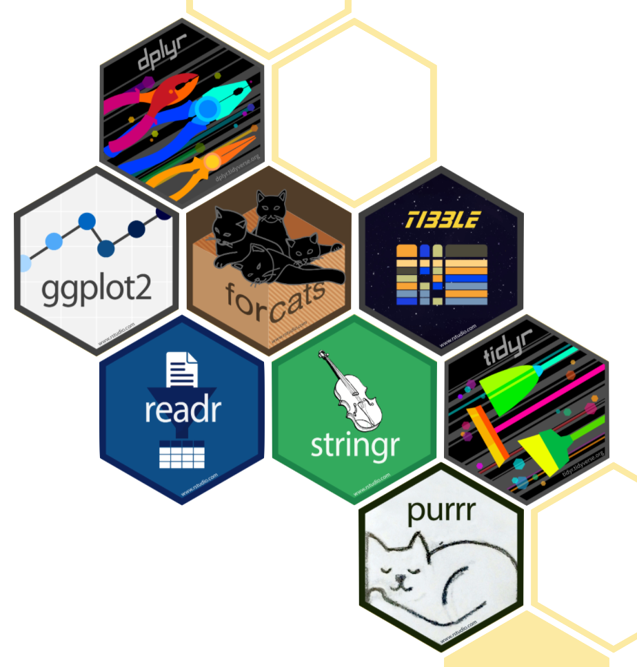

```{r setup, include=FALSE}
knitr::opts_chunk$set(echo = TRUE)
```

## 1. PREPARE

Recall from Unit 1 that we focused on conducting an analysis that help
identify predictors of student performance in these online courses. This
case study is guided by a foundational study in Learning Analytics that
illustrates how analyses like these can be used develop an early warning
system to educators identify students at risk of failing and intervene
before that happens. The Unit 1 case study will cover the following
workflow topics:

1.  **Prepare**: Prior to analysis, it's critical to understand the
    context and data sources you're working with so you can formulate
    useful and answerable questions. You'll also need to become familiar
    with and load essential packages for analysis.
2.  **Wrangle**: Wrangling data entails the work of manipulating,
    cleaning, transforming, and merging data. In Part 2 we focus on
    importing CSV files, tidying and joining our data.
3.  **Explore**: In Part 3, we use basic data visualization and
    calculate some summary statistics to explore our data and see what
    insight it provides in response to our question.
4.  **Model:** After identifying variable that may be related to student
    performance through exploratory analysis, we'll look at correlations
    and create some simple models of our data using linear regression.
5.  **Communicate:** To wrap up our case study, we'll develop our first
    "data product" and share our analyses and findings by creating our
    first web page using R Markdown.

### 1a. Review the Literature

Our Unit 1 Case Study is guided by a well-cited publication from two
authors that have made numerous contributions to the field of Learning
Analytics over the years. Although this article is focused on "early
warning systems" in higher education, and where adoption of learning
management systems (LMS) like Moodle and Canvas gained a quicker
foothold, this study is particularly relevant since COVID-19. Many
districts across the county have incorporated a LMS into their remote
instruction and have set up virtual academies likely to continue
post-pandemic. In North Carolina specifically, student disengagement has
become a particular concern among districtrs and the NC Department of
Public Instruction has recently established the [Office of Learning
Recovery &
Acceleration](https://www.dpi.nc.gov/districts-schools/districts-schools-support/office-learning-recovery-acceleration)**.**

[{width="40%"}](https://doi.org/10.1177/23328584211024261)

Macfadyen, L. P., & Dawson, S. (2010). [Mining LMS data to develop an
"early warning system" for educators: A proof of
concept.](https://www.sciencedirect.com/science/article/pii/S0360131509002486?via%3Dihub)
*Computers & education*, *54*(2), 588-599.

#### Abstract

Earlier studies have suggested that higher education institutions could
harness the predictive power of Learning Management System (LMS) data to
develop reporting tools that identify at-risk students and allow for
more timely pedagogical interventions. This paper confirms and extends
this proposition by providing data from an international research
project investigating **which student online activities accurately
predict academic achievement.** Analysis of LMS tracking data from a
Blackboard Vista-supported course identified 15 variables demonstrating
a significant simple correlation with student final grade... Moreover,
**network analysis of course discussion forums** afforded insight into
the development of the student learning community by identifying
disconnected students, patterns of student-to-student communication, and
instructor positioning within the network. This study affirms that
pedagogically meaningful information can be extracted from LMS-generated
student tracking data, and discusses how these findings are informing
the **development of a dashboard-like reporting tool for educators**
that will extract and visualize real-time data on student engagement and
likelihood of success.

#### Data Sources & Analysis

LIWC...

#### **Summary of Key Findings**

1.  Although 13 LMS variables for this course appear to show significant
    correlation with student final grade, it would be erroneous to rely
    too heavily on the predictive power of simple correlations.
2.  Some students are making more effective strategic decisions about
    time use within the virtual class- room that is not adequately
    represented by simple correlations with time online.
3.  Total number of discussion messages posted, total number of mail
    messages sent, and total number of assessments completed were
    significant contributors to students' final grades and indicated
    that some 33% of the variability in student achievement in this
    course can be explained by this combination of student online
    activities within the course site.
4.  One of the highest performing students established a complex network
    that included a core group of high-performing peers, conversely a
    lower performing student's network is primarily comprised of
    low-performing peers.

#### [**Your Turn**]{style="color: green;"} **⤵**

Take a quick scan of Table 3 in the article linked above (and also
located in your "lit" folder in the files pane) and in the space below,
answer the following question: Of the 13 LMS variables correlated with
student final grade, which 2-3 do you think will found to significantly
predict final grades?

-   

Now take a quick look at sections 3.2 Mutltiple Regression and 3.3
Logistic Regression and asnwer the following questions: What factors in
the model did ultimately predict final grades? How accurate was this
model in identifying "at risk" students?

-   

### 1b. Define Questions

In this study, exploratory research was undertaken to identify the data
variables that would inform the development of a data visualization tool
for instructors. This involved the extraction of all LMS tracking
variables for selected course sections at The University of British
Columbia, Canada. In so doing, the study aimed to address the following
research questions:

1.  Which LMS tracking data variables correlate significantly with
    student achievement?

2.  How accurately can measures of student online activity in an online
    course site predict student achievement in the course under study?

3.  Can tracking data recording online student communication patterns
    offer pedagogically meaningful insights into development of a
    student learning community?

For our case study, we'll adopt questions 1 & 2 wholesale to guide our
exploratory analysis and modeling, with a special emphasis on time spent
in the LMS. We'll also use analytical approaches and data similar to
those used by @macfadyen2010mining to better understand how LMS,
gradebook, and survey data might be predictive of student performance.

### 1c. Load Libraries

As noted in our Getting Started activity, R uses "packages" and add-ons
that enhance its functionality. One of our first steps in any workflow
is to load packages necessary for data wrangling, analysis, and
reporting. We'll load packages in this section we are already familiar
with from our tutorials and introduce new packages and corresponding
functions throughout the case study.

#### tidymodels 📦

{width="40%"}

One package that we'll be using extensively is {tidyverse}. Recall from
earlier tutorials that the {tidyverse} package is actually a [collection
of R packages](https://www.tidyverse.org/packages) designed for reading,
wrangling, and exploring data and which all share an underlying design
philosophy, grammar, and data structures. This shared features are
sometimes "tidy data principles."

Click the green arrow in the right corner of the "code chunk" that
follows to load the {tidyverse} library as well as the {here} package
introduced in previous labs.

```{r}
library(tidymodels)
```

Don't worry if you saw a number of messages: those probably mean that
the tidyverse loaded just fine. Any conflicts you may have seen mean
that functions in these packages you loaded have the same name as
functions in other packages and R will default to function from the last
loaded package unless you specify otherwise.

## 2. WRANGLE

In general, data wrangling involves some combination of cleaning,
reshaping, transforming, and merging data (Wickham & Grolemund, 2017).
The importance of data wrangling is difficult to overstate, as it
involves the initial steps of going from raw data to a dataset that can
be explored and modeled (Krumm et al, 2018). In Part 2, we focus on the
the following workflow processes:

a.  **Import Data**. In this section, we introduce the `read_csv()`
    function for working with CSV files and revisit some key functions
    for inspecting our data.

b.  **Remove NAs**. We introduce the `separate()` and `clean_names()`
    functions for getting our data nice and tidy, and revisit the
    `mutate()` for creating new variables.

c.  **Select Predictors**. We conclude our data wrangling by introducing
    `join()` functions for merging our processed files into a single
    data frame for analysis.

### a. Import Data

To help us import our data, we'll be using two packages:
{[readr](https://readr.tidyverse.org)} and
{[here](https://here.r-lib.org)} . The {readr} package provides a "fast
and friendly way" to read rectangular data stored in plain-text file
formats like csv, tsv, and fwf. If you are new to readr, I highly
recommend the [data import
chapter](https://r4ds.had.co.nz/data-import.html) in R for data science.
We don't need to load the {readr} package because it was already loaded
as part of the tidyverse package we called earlier.

Let's use the `read_csv()` function from {readr} to import our
`log-data.csv` file directly from our data folder and name this data set
`time_spent`, to help us to quickly recollect what function it serves in
this analysis:

```{r}
sci_mo_with_text <- read_csv("data/sci-mo-with-text.csv")
```

#### [**Your Turn**]{style="color: green;"} **⤵**

Now use the code chunk below to take a look at the data you just
imported using your preferred methods.

```{r, eval=FALSE}
sci_mo_with_text
```

Remember, if you use the view function to look at your data, your R
Markdown file will not knit so you will need to set the code chunk to
`eval=FALSE`

In the space below, answer the following questions:

1.  How many observations and variables are in this dataset?
2.  What are some new variables that have been introduced from our
    previous case study and what do they represent? **Hint:** Take a
    look at the our Data Science in Ed course text.
3.  Is there any observations missing data for one or more variables?
    How do you know?
4.  Thinking back on our case study from last week, which variables do
    you think

### b. Select Predictors

As is the case with many datasets you'll work with in education
contexts, there is lots of great information in this dataset - but we
won't need all of it. Even if your dataset has many variables, for most
analyses you will find that you are only interested in some of them.
There are statistical reasons not to include twenty or more variables in
a data analysis as well. At a certain point, adding more variables
will *appear* to make your analysis more accurate, but will in fact
obscure the truth from you. It's generally a good practice to select a
few variables you are interested in and go from there. As we discussed
above, the way to do this is to start with the research questions you
are trying to answer.

I'll use the same pre

```{r}
ds_predictors <- sci_mo_with_text %>%
  select(int,
        uv,
        pc,
        time_spent,
        final_grade,
        subject,
        enrollment_reason,
        semester,
        enrollment_status,
        cogproc,
        social,
        posemo,
        negemo,
        n
)
```

#### [**Your Turn**]{style="color: green;"} **⤵**

Now use the code chunk below to take a look at the data you just
imported using your preferred methods.

```{r}
my_predictors <- sci_mo_with_text %>%
  select(int,
        time_spent,
        final_grade,
        subject,
        enrollment_reason,
        semester,
        enrollment_status,
        cogproc,
        social,
        posemo,
        negemo,
        n
)
```

### c. Remove Missing Data

Since the machine learning model we will be using later in this case
study does not accept missing values

#### `na_omit()`

There are several different ways to remove missing values in R,
including the built-in function `na.omit()` which will remove any
observations, or cases, with missing values for any any of the
variables.

Run the code chunk below to see what happens if we try to remove missing
values using our the entire dataset we originally imported.

```{r}
df <-  na.omit(sci_mo_with_text)

df
```

#### [**Your Turn**]{style="color: green;"} **⤵**

1.  How many observations did this return? Why do you think that is?

#### drop_na() function

Another

```{r}
ds_predictors_complete <- drop_na(ds_predictors)

ds_predictors_complete
```

#### [**Your Turn**]{style="color: green;"} **⤵**

Use the following code chunk to ...

```{r}
my_predictors_complete <- drop_na(my_predictors)

my_predictors_complete
```

1.  How many observations did this return? Why do you think that is?

### c. Check Variance 

Since the machine learning model we will be using later in this case
study does not accept missing values

```{r}
nearZeroVar(ds_predictors_complete, saveMetrics = TRUE)
```

```{r}
step_nzv(ds_predictors_complete)
```

### d. Convert to Factors 

Since the machine learning model we will be using later in this case
study does not accept missing values

Congratulations! We're done wrangling our data and it is ready to
explore!

## 3. EXPLORE

As highlighted in both
[DSEIUR](https://datascienceineducation.com/c03.html#doing-analysis-exploring-visualizing-and-modeling-data)
and Learning Analytics Goes to School, calculating summary statistics
and data visualization are a key part of exploratory data analysis. One
goal in this phase is explore questions that drove the original analysis
and develop new questions and hypotheses to test in later stages. Topics
addressed in Part 3 include:

-   **Summarize Key Stats**. We'll learn about the {skmir} package for
    pulling together some quick creating descriptive statistics when
    your goal is to understand your data internally.

-   **Visualize Data**. We'll introduce the histogram geom for taking a
    quick peak the distributions of some key variables and put together
    some scatter plots for examining potential relationships between
    time spent and student performance.

-   **Correlated Variables.** We'll wrap up our Part 3 by learning to
    create a correlation matrix for quantifying these relationships
    between key variables and student performance.

### a. Table Summaries

At this point, we should have quite the comprehensive data set,
including single measures from a) students for the time they spent in
the course LMS and other information about them, such as information on
why they are enrolled in the course, b) their academic achievement.

#### Skimr Package

{width="25%"}

An efficient package for creating descriptive statistics *when your goal
is to understand your data internally* (rather than to create a table
for an external-to-the-research-team audience, like for a journal
article) is the {skimr} package. A key feature of the {skimr} package is
that it works well with the {tidyverse} packages we are using: it takes
data frames as input, and returns data frames as output, which means we
can manipulate them with {tidyverse} functions like `select()`,
`filter()`, and `arrange()`, for example.

Let's load the {skimr} package:

```{r}
library(skimr)
```

The challenge here is not the complexity of the `skim()` function, per
se, but will be comprehending the terminology. In the code chunk below:

-   Pass to the `skim()` function a single argument (recall from our
    tutorials last week that functions have *names* and *arguments!*)

-   That single *argument* is the data frame (aka in tidyverse parlance,
    a tibble) for which you are aiming to calculate descriptive
    statistics

Run the following code to "skim" our `data_to_explore` tibble:

```{r}
skim(data_to_explore)
```

**Note:** If you are having difficult viewing your data in the code
chunk, try clicking the icon in the output that looks like a spreadsheet
with an arrow on it to expand your output in a separate window.

What do you notice about the output? These observations might pertain to
the format of the output or its values (i.e., what the mean for the
`val` variable is). Note one or two of these noticings or wonderings
below:

-   

As we noted earlier, the {skimr} package works nicely with other
{tidyverse} functions.

**Hint:** For help, also consider running `?skim()` in the console to
view the documentation for the function.

#### [**Your Turn**]{style="color: green;"} **⤵**

Recall from the Week 3 tutorials and exercises how we how we isolated
data using the `select()` and `filter()` functions. In the code chunk
below, look at descriptives for just `proportion_earned` , `time_spent`
and `gender`, but only for the "OcnA" and "PhysA" subjects.

Can you do this by modifying the code below to do this?

```{r}
data_to_explore %>% 
  select(proportion_earned, time_spent, gender, subject) %>% 
  filter(subject == "OcnA" | subject == "PhysA") %>%
  skim()
```

We noted earlier that this output is best for internal use. This is
because the output is rich, but not well-suited to exporting to a table
that you add, for instance, to a Google Docs or Microsoft Word
manuscript. Of course, these values can be entered manually into a
table, but we'll also discuss ways later on to create tables that are
ready--or nearly-ready--to be added directly to manuscripts.

If you are curious about doing more with {skimr}, check out:
[\<https://cran.r-project.org/web/packages/skimr/vignettes/skimr.html\>](https://cran.r-project.org/web/packages/skimr/vignettes/skimr.html){.uri}

### b. Data Visualization

#### Histograms

You likely notice that the `skim()` function created some miniature
histrograms for each of the numeric variables in our `data-to-explore`
data frame. Since we are especially interested in whether time spent in
the online course is related to student performance, let's take a closer
look at this variable.

The code below creates a histogram with 30 bins---the default number for
`geom_histogram`:

```{r}
data_to_explore %>% 
  ggplot(aes(x = time_spent_hours)) +
  geom_histogram(bins = 30)
```

#### [**Your Turn**]{style="color: green;"} **⤵**

Now change the number of bins using the code chunk below below and note
any differences in what you interpret about the data.

```{r}

```

What do you think the ideal number of bins is---with what is ideal being
the number of bins that helps you to interpret the overall distribution
of the values for how much time students' spent (*note*: there is no one
right or wrong answer here!)?

-   

#### Faceting

We'll next be using the `facet_wrap()` function to create *small
multiples*, or plots that are specific to subsets of your data. These
subsets are identified based on another variable in your dataset. For
example, the code below uses the built-in `mpg` dataset to plot the
relationship between the displacement of a car's engine and its highway
miles per gallon fuel efficiency.

```{r}
ggplot(mpg, aes(displ, hwy)) + 
  geom_point()
```

The code in the next plot creates individual plots for each
class---think compact car or SUV.

```{r}
ggplot(mpg, aes(displ, hwy)) + 
  geom_point() +
  facet_wrap(~class)
```

#### [**Your Turn**]{style="color: green;"} **⤵**

In the code below, create a faceted histogram based on the subject of
the course. To do so, consider both:

-   What code you used to create the histogram of the time students'
    spent on the course

-   How, in the example above, `facet_wrap` refers to the variable in
    that data frame that represents the class of the car---but modifying
    the code to work for your subject variable

You may also wish to change the color; reflect back to the getting
started task for an example of how to do this.

```{r}
ggplot(data_to_explore, aes(x = time_spent_hours)) + 
  geom_histogram() +
  facet_wrap(~subject)
```

What do you notice about this figure? What questions do you have? Add a
note (or a few notes!) below:

-   

#### Scatter Plots

Having prepared the data sets we joined together, and worked hard to
join those data sets, we're now ready to use this joined data set in our
exploration of how the time students spent on the course LMS relate to
the number of points they earned throughout the course.

We'll be using the {ggplot2} package again, but, this time, will be
creating a different type of plot.

Run the code below to create a scatter plot of the proportion of points
students earned and the number of hours they spent on the course LMS.

```{r}
ggplot(data_to_explore, aes(x = time_spent_hours, y = proportion_earned)) +
  geom_point()
```

What do you notice about this graph? And what do you wonder? How about
the code---what do you notice about it (and what do you wonder)? Add one
or more of what you see as the most important elements.

-   

Using {ggplot2} makes it efficient to iterate through different versions
of similar plots. For instance, we can color the points by a third
variable, such as the reason for which students enrolled in the course,
to begin to explore what was going on for students who spent very little
time on the course:

```{r}
ggplot(data_to_explore, aes(x = time_spent_hours, y = proportion_earned, color = enrollment_status)) +
  geom_point()
```

#### [**Your Turn**]{style="color: green;"} **⤵**

We can also additionally create faceted plots, like the one you created
in the last learning lab. In the code below, facet the plot by
`subject`.

```{r}
ggplot(data_to_explore, aes(x = time_spent_hours, y = proportion_earned, color = enrollment_status)) +
  geom_point() +
  facet_wrap(~subject)
```

You may wish to style your plot. A few ways you can do that are as
follows; we'll discuss more throughout the institute. For each of the
following, add them to your plot by adding a plus symbol to the line
prior to the line you are adding. For instance, the following code
styles the x-axis label of a plot:

```{r}
ggplot(data_to_explore, aes(x = time_spent_hours, y = proportion_earned, color = enrollment_status)) +
  geom_point() +
  xlab("Time Spent (Hours)")
```

Try adding (and modifying, if you'd like) any of the following to the
faceted plot you created in the code chunk below:

-   `xlab("Time Spent (Hours)")`

-   `ylab("Proportion of Points Earned")`

-   `scale_color_brewer("Enrollment Status", type = "qual", palette = 3)`

-   `ggtitle("How Time Spent on Course LMS is Related to Points Earned in the Course")`

-   `theme(legend.position = "bottom")`

```{r}

```

Once you have settled on a plot you are happy with (for now!), add a
sentence or two interpreting your graph (like you were describing it
within a journal article):

-   

### c. Create a Correlation Matrix

As highlighted in @macfadyen2010, the scatter plots are a useful initial
approach for identifying potential correlational trends between
variables under investigation, but to further interrogate the
significance of selected variables as indicators of student achievement,
a simple correlation analysis of each variable with student final grade
can be conducted.

There are two efficient ways to create correlation matrices, one that is
best for internal use, and one that is best for inclusion in a
manuscript.

#### Corrr Package

{width="25%"}

First, the {corrr} package provides a way to create a correlation matrix
in a {tidyverse}-friendly way. Like for the {skimr} package, it can take
as little as a line of code to create a correlation matrix. If not
familiar, a correlation matrix is a table that presents how *all of the
variables* are related to *all of the other variables*.

Run the following code to load the {corrr} package:

```{r}
library(corrr)
```

#### Time Spent and Course Grade

Since the primary purpose of this case study is to investigate whether
time spent in an online course is predictive of student achievement,
let's first take a look and see if there is a simple correlation between
time spent and student achievement.

Run the following code to create a simple correlation matrix using the
`correlate()` function from the {corrr} package:

```{r}
data_to_explore %>% 
  select(proportion_earned, time_spent_hours) %>%
  correlate()
```

For the purpose of printing, and as a quick aside, the {corrr} package
also has a nice `fashion()` function for converting a correlation data
frame into a matrix with the correlations cleanly formatted (leading
zeros removed; spaced for signs) and the diagonal (or any NA) left
blank.

Run the following code to try it out:

```{r}
data_to_explore %>% 
  select(proportion_earned, time_spent_hours, int, val, percomp) %>% 
  correlate() %>% 
  rearrange() %>%
  shave() %>%
  fashion()
```

#### [**Your Turn**]{style="color: green;"} **⤵**

In the code chunk below, select 3-4 numeric variables in addition to
`time_spent_hours` that you think may be related to student achievement,
i.e. `proportion_earned`, and run a simple correlation.

```{r}

```

**Hint:** One key is to correlate only numeric variables. Note that
while some numeric variables can *technically* be used, it is likely not
sensible to correlate all of the variables; some---for instance, the
`section` variable---are not very sensible to correlate!

What did you find? Were your selected variables related to time spent in
the course? These observations might pertain to the format of the output
or its values (i.e., what the mean for the `val` variable is). Note one
or two of these noticings or wonderings below:

-   

If you are interested in learning more about the {corrr} package, visit:
[\<https://corrr.tidymodels.org\>](https://corrr.tidymodels.org){.uri}

#### APA Formatted Tables

As we noted earlier, the {skimr} package works nicely with other
{tidyverse} functions. While {corrr} is a nice package to quickly create
a correlation matrix, you may wish to create one that is ready to be
added directly to a dissertation or journal article. {apaTables} is
great for creating more formal forms of output that can be added
directly to an APA-formatted manuscript; it also has functionality for
regression and other types of model output. It is not as friendly to
{tidyverse} functions; first, we need to select only the variables we
wish to correlate.

Then, we can use that subset of the variables as the argument to
the`apa.cor.table()` function.

Run the following code to create a subset of the larger
`data_to_explore` data frame with the variables you wish to correlate,
then create a correlation table using `apa.cor.table()`.

```{r}
library(apaTables)

data_to_explore_subset <- data_to_explore %>% 
  select(time_spent_hours, proportion_earned, int)

apa.cor.table(data_to_explore_subset)
```

This may look nice, but how to actually add this into a dissertation or
journal article that you might be interested in publishing? Read the
documentation for `apa.cor.table()` by running `?apa.cor.table()` in the
console. Look through the documentation and examples to understand how
to output a file with the formatted correlation table, and then run the
code to do that with your subset of the `data_to_explore` data frame.

```{r}
apa.cor.table(data_to_explore_subset, filename = "cor-table.doc")
```

You should now see a new Word document in your project folder called
`survey-cor-table.doc`. Click on that and you'll be prompted to download
from your browser.

## 4. MODEL

As highlighted in [Chapter 3 of Data Science in Education Using
R](https://datascienceineducation.com/c03.html), the **Model** step of
the data science process entails "using statistical models, from simple
to complex, to understand trends and patterns in the data." The authors
note that while descriptive statistics and data visualization during
the **Explore** step can help us to identify patterns and relationships
in our data, statistical models can be used to help us determine if
relationships, patterns and trends are actually meaningful. In part Part
4 we will learn how to:

### a. Predict Academic Achievement

For the purpose of this case study, let's consider the
`proportion_earned` variable to be our dependent, or the outcome,
variable. You may be new to linear regression models, or you may have a
lot of experience. In brief, a linear regression model involves
estimating the relationships between one or more *independent variables*
with one dependent variable. Mathematically, it can be written like the
following.

$$
\operatorname{dependentvar} = \beta_{0} + \beta_{1}(\operatorname{independentvar}) + \epsilon
$$

Here, the `dependentvar` is predicted by two *coefficients*, or things
that help to explain the dependent variable. The first coefficient,
$\beta_0$, is the intercept. This coefficient tells us what the
estimated value of the dependent variable is when the independent
variable (`independentvar`) is equal to 0. The other coefficient,
$\beta_1$, or the slope, represents the association of a one-unit change
in the independent variable in the value of the dependent variable.

#### Does Time Spent Predict Grade Earned?

Let's consider a simple concrete example. We'll use the `lm()` function
in R to estimate a linear regression model.

The following code estimates a model in which `proportion_earned`, the
proportion of points students earned, is the dependent variable. It is
predicted by one independent variable, `int`, students' self-reported
interest in science.

```{r}
lm(proportion_earned ~ time_spent_hours, 
   data = data_to_explore)
```

Let's take a look at the output.

We can see that the intercept is estimated at 0.53. This tells us that
when students' time spent in the online course is equal to zero, their
predicted proportion of points earned is 0.62---not such a great grade,
but also not surprising! But, for every one-unit, or hour, increase in
time spent in science, their estimate proportion of points earned was
0.0048. So if a student spent, for instance, 40 hours on the course,
their estimated final grade would be .62 + (.0048 \* 40), or around .82,
or 82%. A pretty solid B-!

#### How about interest in science?

We can add additional predictor variables by separating variables with a
plus symbol. Run the following code to add `int`, students'
self-reported interest in science, to our linear model:

```{r}
lm(proportion_earned ~ time_spent_hours + int, 
   data = data_to_explore)
```

We can see that the intercept is now estimated at 0.44, which tells us
that when students' time spent and interest are equal to zero, they are
likely fail the course unsurprisingly. Note that that estimate for
interest in science is .046, so for every one-unit increase in `int`, we
should expect an 5 percentage point increase in their grade.

We can save the output of the function to an object---let's say `m1`,
standing for model 1. We can then use the `summary()` function built
into R to view a much more feature-rich summary of the estimated model.

```{r}
m1 <- lm(proportion_earned ~ time_spent_hours + int, data = data_to_explore)

summary(m1)
```

There is a lot to unpack in this output, but for now the most important
values to look at are those in the Estimate column, which represent the
intercept and slopes for your linear regression model.

Note that the estimate for `time_spent_hours` is now 0.0042 and
statistically significant. We see that `int`, interest in science, is
also statistically significant.

#### Do average students earn an average grade?

Now let's consider the mean values for each of these predictors. Recall
from our tutorials last week the `summarize()` function from the {dplyr}
package used to create summary statistics such as the mean, standard
deviation, or the minimum or maximum of a value. At its core, think of
`summarize()` as a function that returns a single value (whether it's a
mean, median, standard deviation---whichever!) that summarizes a single
column.

Let's use the summarize function to calculate the means for time spent
and interest in science and add the argument `na.rm = TRUE` to tell R
that it can ignore missing, or `NA` values, and to calculate the summary
statistic using the non-missing values.

```{r}
data_to_explore %>% 
  summarize(mean_interest = mean(int, na.rm = TRUE),
            mean_time = mean(time_spent_hours, na.rm = TRUE))
```

The mean value for interest is quite high. If we multiply the estimate
relationship between interest and proportion of points
earned---0.046---by this, the mean interest across all of the
students---we can determine that students' estimate final grade was
0.046 X 4.3, or **0.197**. For hours spent spent, the average students'
estimate final grade was 0.0042 X 30.48, or **0.128**.

If we add both 0.197 and 0.128 to the intercept, 0.449, that equals
0.774, or about 77%. In other words, a student with average interest in
science who spent an average amount of time in the course earned a
pretty average grade.

Finally, similar to our APA formatted correlation table above, we can
use the {apaTables} package to create a nice regression table that could
be used for later publication:

```{r}
apa.reg.table(m1, filename = "lm-table.doc")
```

#### [**Your Turn**]{style="color: green;"} **⤵**

Below, estimate different regression models with at least 2 variables,
save as `m2`, and view a `summary()` of the results:

```{r}
m2 <- lm(proportion_earned ~ int + time_spent_hours + gender + val, data = data_to_explore)

summary(m2)
```

Add a brief note or two interpreting the above model (`m2`):

-   

## 5. COMMUNICATE

The final(ish) step in our workflow/process is sharing the results of
analysis with wider audience. Krumm et al. (2018) have outline the
following 3-step process for communicating with education stakeholders
what you have learned through analysis:

1.  **Select**. Communicating what one has learned involves selecting
    among those analyses that are most important and most useful to an
    intended audience, as well as selecting a form for displaying that
    information, such as a graph or table in static or interactive form,
    i.e. a "data product."

2.  **Polish**. After creating initial versions of data products,
    research teams often spend time refining or polishing them, by
    adding or editing titles, labels, and notations and by working with
    colors and shapes to highlight key points.

3.  **Narrate**. Writing a narrative to accompany the data products
    involves, at a minimum, pairing a data product with its related
    research question, describing how best to interpret the data
    product, and explaining the ways in which the data product helps
    answer the research question.

For Unit 1 we will keep it simple. In the code chunk below, select a
chart, table or model created above (or create an entirely new one based
a new analysis) that you think an education stakeholder might find
interesting. Beneath the code chunk, write a very brief narrative to
accompany your narrative.

### My First Data Product (Change Me)

```{r}

```

### Congratulations!

You've completed the first case study! To "turn in" your work, you can
click the "Knit" icon at the top of the file, or click the dropdown
arrow next to it and select "Knit top HTML". This will create a report
in your Files pane that serves as a record of your completed assignment
and its output you can open or share.
